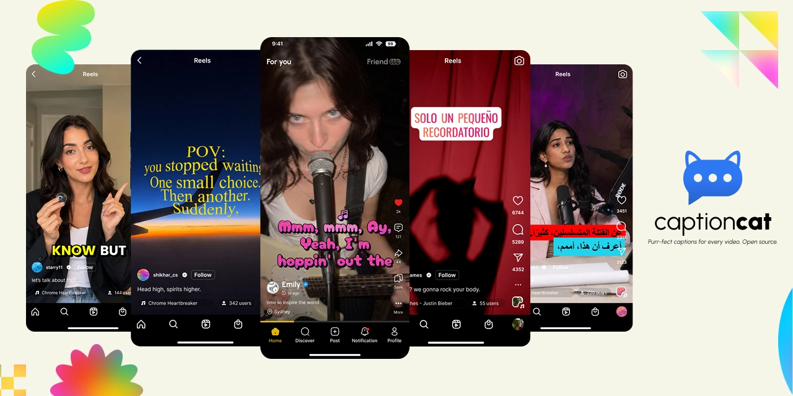
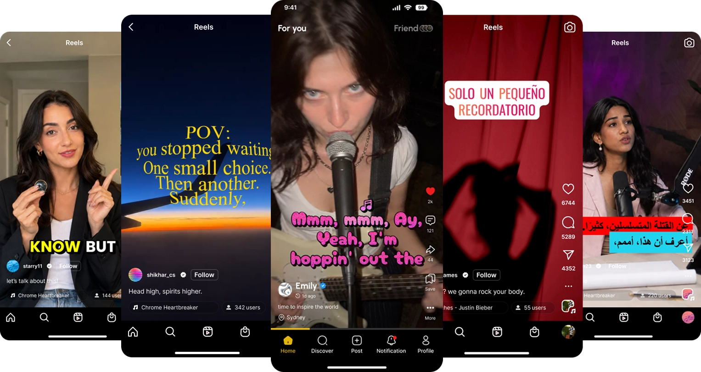
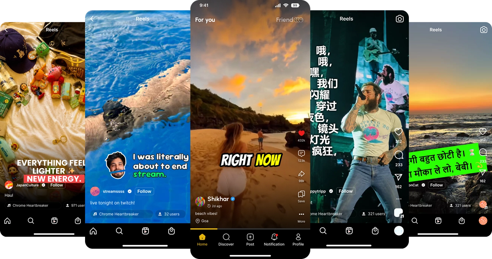
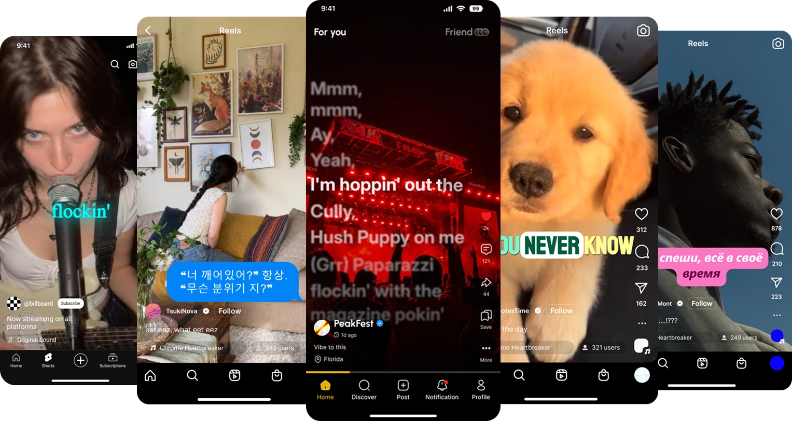

<div align="center">

<picture>
  <source srcset="assets/svg/branding/captioncat-logo-lockup.svg"
          media="(prefers-color-scheme: dark)">
  
</picture>

<h1>captioncat</h1>

<p><strong>Beautiful, expressive captions - designed, animated, and rendered in code.</strong></p>

<p>
  <a href="#documentation">Documentation</a> |
  <a href="docs/getting-started.md">Get Started</a> |
  <a href="docs/preset-studio.md">Preset Studio</a> |
  <a href="docs/presets.md">Presets</a>
</p>

[](https://www.npmjs.com/package/@captioncat/caption-engine)
[](https://www.npmjs.com/package/@captioncat/caption-engine)
[](https://github.com/ItisShikhar/captioncat/stargazers)
[](LICENSE)

⭐ _Help us reach more developers and grow the captioncat community. Star this repo!_

</div>

<p align="center">
  
</p>

## What is captioncat?

**captioncat is an open-source engine for designing, animating, and rendering expressive captions for videos and audios.**

Create reusable **style presets** with control over typography, layout, animation, effects, backgrounds, and positioning.

Render captions directly onto videos, export standalone caption movies, or export subtitle files.

Create captions in any language, use an existing transcript or caption file, or
transcribe directly from video or audio.

## Why captioncat?

Basic subtitle files store text and timing. They do not describe the visual
composition of the caption.

> Video is becoming the default way we create, consume, and share content.

YouTube Shorts alone now averages **200+ billion daily views**, while more than
**20 million videos are uploaded to YouTube every day**.

Captions are becoming part of the visual language of video. Nearly **half of
all viewing hours on Netflix in the U.S. happen with subtitles or captions
enabled**, and research across hundreds of studies shows subtitles have evolved
beyond accessibility into a mainstream part of media consumption. [^2][^3]

And the way captions are designed matters. Research has found measurable effects
on **views, engagement, visual attention, comprehension, and viewer comfort**,
depending on the platform and viewing context. [^1][^4]

**captioncat gives the building blocks to
design, animate, and render that visual layer programmatically.**

Instead of treating captions as static subtitle files, captioncat treats them
as **programmable, reusable visual compositions** - with control over
typography, layout, timing, animation, effects, positioning, and rendering.

These compositions can be **stored as reusable JSON presets**, keeping their
visual design and behavior separate from the caption content itself.

## Showcase

See what you can build with **captioncat**.

<p align="center">
  
</p>

<p align="center">
  
</p>

<p align="center">
  
</p>

See the [full bundled preset gallery](docs/presets.md#preview-gallery).

See the [full showcase](docs/showcase.md), including [live examples](docs/showcase.md#watch-live-examples).

## Features

Built for developers, creators and AI agents who want more than basic subtitles.

> Programmatic control over the entire caption rendering process, from timing and layout to typography, animation, and effects.

- **Designable captions** - typography, layout, animation, effects, backgrounds, positioning, and more
- **Rich animation** - keyframes, transitions, layout motion, and effects
- **Reusable presets** - bundled presets or custom JSON
- **Multilingual** - LTR, RTL, and automatic text direction
- **AI-ready** - Transcribe directly from video or audio using supported transcription providers like OpenAI, ElevenLabs, and Sarvam.
- **Multiple outputs** - captioned video, standalone caption movies, PNG sequences, ASS,
  SRT, VTT, and JSON
- **Font control** - bundled, Google Fonts, remote, and system fonts
- **captioncat Preset Studio** - visual preset authoring with JSON import and export
- **Caption stability** - captioncat implements related stability techniques described in [Google's research][5]:
  - **Stable frame placement** - The engine keeps the crop and caption placement fixed across frames. This reduces movement during playback and scrubbing. See [Rendering](docs/rendering.md).
  - **Stable flow layout** - Flow policies can reserve space for collapsed rows or words instead of reflowing later content. See [caption-layout.ts](src/caption-engine/entity-system/caption-layout.ts) and [layout-engine.ts](src/caption-engine/entity-system/layout-engine.ts).
  - **Caption gap holding** - `captionHoldThresholdSeconds` keeps the previous caption visible across short timing gaps. See [Rendering](docs/rendering.md) and [render-utilities.ts](src/caption-engine/render-utilities.ts).
  - **Scope** - The engine does not implement the article's token alignment, semantic merging, or flicker metric for live ASR updates.

## Installation

Install the package:

```bash
npm install @captioncat/caption-engine
```

> Requires Node.js `22.0.0` or later. Older versions may work, but
> are not officially supported.

<details>
<summary>Other package managers</summary>

```bash
yarn add @captioncat/caption-engine
```

```bash
pnpm add @captioncat/caption-engine
```

</details>

The package includes the engine, CLI, FFmpeg binaries, Skia Canvas, preset assets, and bundled font assets.

## Quick start

Transcribe & Render captions over a video:

```ts
import { CaptionPreset, TranscriptionProviderName, createCaptionCat } from '@captioncat/caption-engine';

const captionCatEngine = createCaptionCat();

await captionCatEngine.render({
  input: {
    video: 'video.mp4',
  },
  transcription: {
    providers: [
      {
        provider: TranscriptionProviderName.OpenAI,
        apiKey: process.env.OPENAI_API_KEY,
      },
      {
        provider: TranscriptionProviderName.ElevenLabs,
        apiKey: process.env.ELEVENLABS_API_KEY,
      },
    ],
  },
  renders: [
    {
      preset: CaptionPreset.Punch,
      outputs: {
        overlayVideo: {
          path: 'output/video.mp4',
        },
      },
    },
  ],
});
```

`CaptionPreset.Punch` selects a bundled caption style. See the
[complete `CaptionPreset` member list](docs/presets.md#captionpreset-members).

When captions or a transcript are not provided, captioncat transcribes the
input video or audio using the configured transcription providers. Providers are tried in priority order, with automatic fallback when a provider key is invalid or transcription fails.

See
[Transcription providers](docs/rendering.md#transcription-providers).

> [!TIP]
> Set your provider API keys as environment variables.

Presets include timing and caption layout settings. Override them for an individual render with `renders[].settings`:

```ts
renders: [
  {
    preset: CaptionPreset.Punch,
    settings: {
      timing: {
        captionHoldThresholdSeconds: 0.5,
      },
      captionLayout: {
        horizontalFit: 'shrink-to-fit',
        rowsPerPage: {
          mode: 'fixed',
          count: 2,
        },
      },
    },
    outputs: {
      overlayVideo: {
        path: 'output/video.mp4',
      },
    },
  },
];
```

> All settings are optional. Unspecified settings inherit the values from the
> selected preset.

See [Getting started](docs/getting-started.md) for prepared captions, transcript
inputs, provider setup, preset settings, and standalone caption outputs.

Need more control? See [Render request](docs/rendering.md#render-request).

## Inputs and outputs

The engine separates media inputs, transcript and subtitle exports, and visual
caption renders.

| Input or output          | Purpose                                         |
| ------------------------ | ----------------------------------------------- |
| Video                    | Source video for an overlay render.             |
| Audio                    | Source audio or replacement audio.              |
| Captions                 | SRT, VTT, ASS, or JSON caption input.           |
| Transcript               | Prepared timed transcript entries.              |
| Captioned video          | Captions composited over the input video.       |
| Standalone caption movie | Caption frames for external compositing.        |
| PNG sequence             | One transparent caption frame per output frame. |
| ASS, SRT, VTT            | Subtitle exports.                               |
| JSON                     | Transcript export.                              |

Read [Rendering](docs/rendering.md) for the request contract, output sizing,
source priority, and compositor behavior.

## Presets

A **preset** defines the visual style and behavior of a caption. It controls
how captions look, move, and respond to the transcript, including typography,
layout, animation, effects, backgrounds, and positioning.

captioncat includes **36 handcrafted presets** that you can use out of the box.
You can also create your own presets and load them from a local JSON file, an
HTTP(S) URL, or an inline ECS object.

```ts
const render = {
  preset: CaptionPreset.Punch,
  outputs: {
    overlayVideo: {
      path: 'output/video.mp4',
    },
  },
};
```

Under the hood, presets are defined using captioncat's Entity Component
System (ECS) format, which makes caption styles composable and reusable.

Read [Presets](docs/presets.md) for the preset format, custom preset sources, layout behavior, and the full bundled catalog.

> View the [Showcase](docs/showcase.md) for examples and inspiration.

## captioncat Preset Studio

**captioncat Preset Studio** is a visual editor for creating and customizing
caption presets. It provides hierarchy editing, live preview, typography and
effect controls, animation editing, and JSON import and export.

Preset Studio is distributed as a **single-file HTML app** that runs locally in
your browser with no installation required.

[Launch **captioncat** Preset Studio online](https://itisshikhar.github.io/captioncat/captioncat-preset-studio/)
**or**
[Download **captioncat** Preset Studio from the latest release](https://github.com/ItisShikhar/captioncat/releases/latest)

Preset Studio is a private package and is not published to npm. The root
[`package.json`](package.json) version is the release source of truth for both
the caption engine and the Studio artifact. The Studio HTML uses the root
engine version in its filename:

```text
captioncat-preset-studio-v<root-engine-version>.html
```

See the [release guide](docs/releasing.md) for the maintainer release process.

<table>
  <tr>
    <td align="center">
      
      <br><sub>Real-time preview and word inspector</sub>
    </td>
    <td align="center">
      
      <br><sub>Multi-view previews</sub>
    </td>
  </tr>
  <tr>
    <td align="center">
      
      <br><sub>Debug overlays and layout bounds</sub>
    </td>
    <td align="center">
      
      <br><sub>Animation tracks editor</sub>
    </td>
  </tr>
</table>

To build Preset Studio locally:

```bash
cd tools/preset-studio
npm install
npm run build
```

Open `tools/preset-studio/dist/captioncat-preset-studio-v<root-engine-version>.html` in a
**Chromium-based browser**.

See the [Preset Studio guide](docs/preset-studio.md) for editor features and
development details.

> Note on fonts: captioncat supports bundled fonts, Google Fonts, remote
> font URLs, and system fallbacks. Fonts are loaded before text measurement to
> preserve predictable layouts across languages.

> For font storage, loading, and fallback behavior, see the [Font component](docs/components/font.md) and [font loading](docs/rendering.md#font-loading) guides.

## CLI

> All CLI examples use fenced code blocks. Each command stays on one physical
> line so you can copy and paste it without editing.

Install the CLI globally:

```bash
npm install --global @captioncat/caption-engine
```

Render captions:

```cmd
captioncat render --input-video input.mp4 --provider openai --preset-id punch --video-output output/video.mp4
```

When `--video-output` is omitted, the CLI writes
`captions-output/punch/input-captioncat.mp4`.

Other commands:

```cmd
captioncat transcribe input.mp4 --provider openai
captioncat ass transcript.json --output captions.ass
captioncat png transcript.json --preset-id punch --frames captions-output
```

Read the [CLI guide](docs/cli.md) for all options and provider environment
variables.

## Architecture

### The problem

- Browser Canvas requires a browser runtime and does not provide a complete media processing or video encoding pipeline. Font loading and text measurement can also vary across environments.

- FFmpeg is excellent for media processing and encoding, but complex captions require per-word layout, timing, animations, and effects that can lead to large and difficult-to-maintain filter graphs.

### The solution

**captioncat** uses each tool for what it does best:

- Skia Canvas - renders caption frames with precise control over text, layout, shapes, images, animations, and effects.
- FFmpeg - handles media processing, compositing, audio, and video encoding.

Skia runs directly in Node.js without a browser or DOM, making it well suited for server-side rendering.

### How does the engine work

#### Rendering pipeline

1. Read a video, audio file, transcript, or caption file.
2. Apply a preset to determine timing, layout, typography, animation, and effects.
3. Render caption frames with Skia Canvas.
4. Composite the frames and process the media with FFmpeg.
5. Output a captioned video, standalone caption movie, image sequence, or subtitle file.

This separation gives captioncat precise control over complex caption visuals without forcing them into large, difficult-to-maintain FFmpeg filter graphs.

Skia Canvas renders the captions. FFmpeg handles the video.

### Preset

**captioncat** separates transcription, caption layout, animation, and rendering.
Caption styles use ECS-based presets, so components and effects can be composed
independently.

Read [Architecture](docs/architecture.md) for the ECS model, state system,
layout engine, and animation pipeline.

## Documentation

- [Getting started](docs/getting-started.md)
- [Quick-start examples](docs/quick-start-examples.md)
- [Rendering](docs/rendering.md)
- [Render pipeline](docs/render-pipeline.md)
- [Presets](docs/presets.md)
- [Preset Studio](docs/preset-studio.md)
- [Effects and components](docs/effects-and-components.md)
- [Architecture](docs/architecture.md)
- [CLI](docs/cli.md)
- [Releasing](docs/releasing.md)
- [Development](docs/development.md)
- [Contributing](CONTRIBUTING.md)
- [Changelog](CHANGELOG.md)
- [Showcase](docs/showcase.md)

## Roadmap

- More caption presets and effects
- More transcription providers
- More output backends
- Bun runtime support
- Public preset gallery
- Multi-surface captions
- Speaker-aware caption styles
- Fine-grained LLM selection
- More CLI capabilities
- More detailed Preset Studio documentation

The roadmap is exploratory and has no date commitments. Open an issue to
discuss a proposal.

## Contributing

Contributions are welcome, whether they improve performance, fix bugs, add
presets, components or effects, expand examples and tests, or improve documentation.
See [Contributing](CONTRIBUTING.md) before opening a pull request.

## Author

Built by [Shikhar Srivastava](https://www.linkedin.com/in/itisshikhar/).

[GitHub](https://github.com/ItisShikhar) ·
[LinkedIn](https://www.linkedin.com/in/itisshikhar/)

captioncat is an open-source project exploring design-first, scene-based, programmable caption
rendering across [Skia Canvas](https://github.com/samizdatco/skia-canvas) (powered by
[Google's Skia graphics engine](https://skia.org/)),
[browser Canvas](https://developer.mozilla.org/en-US/docs/Web/API/Canvas_API), and [FFmpeg](https://github.com/FFmpeg/FFmpeg).

## License

captioncat is released under the [MIT License](LICENSE).

## References

[^1]: [Do Captions Help Short Videos Get More Views?](https://ascynd.io/en/blog/do-captions-increase-video-views)

[^2]: [Netflix Study: A new way to experience subtitles](https://about.netflix.com/en/news/introducing-a-new-way-to-experience-subtitles)

[^3]: [Like, Comment & Caption: A Decade of Social Media Video Caption Research (2015–2025). Nguyen, Huong & McDonnell, Emma & May, Lloyd & Druzenko, Alexander & Syeda, Zoobia & Cartwright, Mark & Lee, Sooyeon. (2026). 1-23. 10.1145/3772318.3791868.](https://www.researchgate.net/publication/403756423_Like_Comment_Caption_A_Decade_of_Social_Media_Video_Caption_Research_2015-2025)

[^4]: [Li, G. 2026. Attention Allocation During Viewing of One-Line and Two-Line Subtitles in Vertical Videos. Applied Cognitive Psychology 40, no. 4: e70262.](https://doi.org/10.1002/acp.70262)

[^5]: [Google Research: Modeling and Improving Text Stability in Live Captions](https://research.google/blog/modeling-and-improving-text-stability-in-live-captions/)

[5]: https://research.google/blog/modeling-and-improving-text-stability-in-live-captions/ 'Google Research: Modeling and Improving Text Stability in Live Captions'
