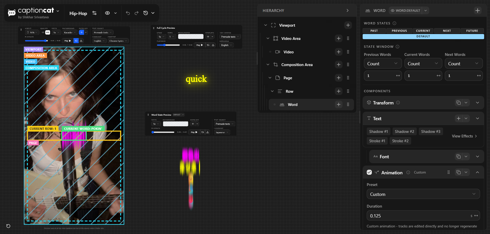
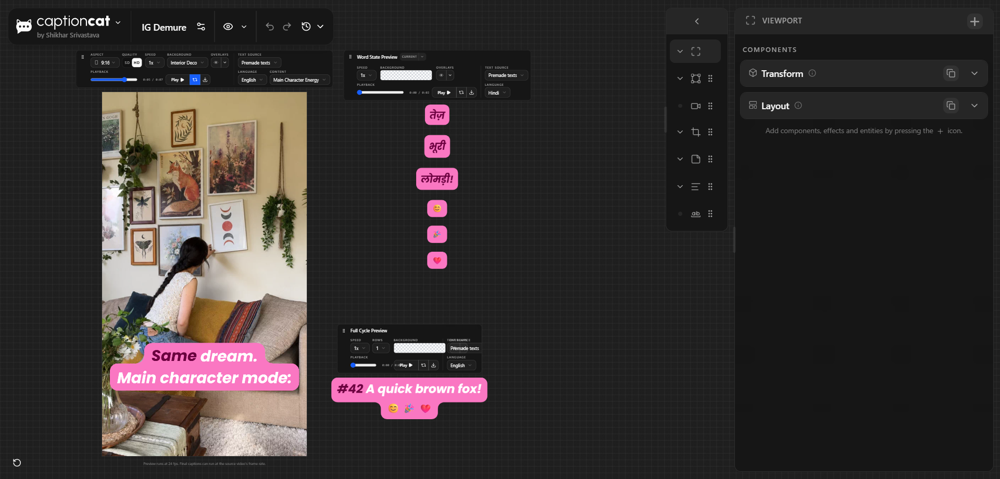
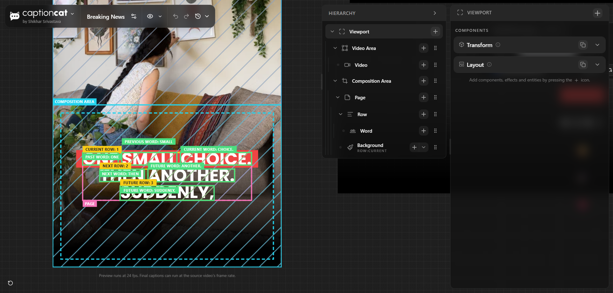
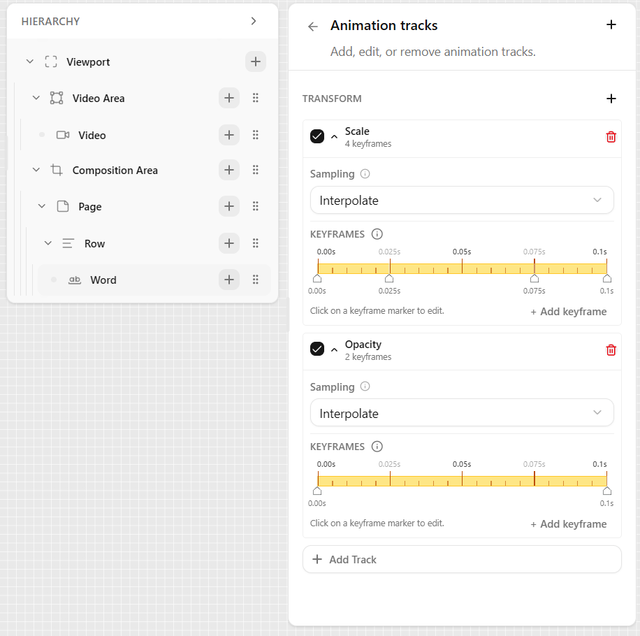

# captioncat Preset Studio

_Reference: [Entity Component System (ECS)](https://en.wikipedia.org/wiki/Entity_component_system)_

captioncat Preset Studio is a browser editor for ECS preset documents. It uses
the shared caption engine for live previews.

The Studio uses React, TypeScript, Vite, and Tailwind CSS.

The engine owns the canonical preset document contract. The CLI and the Studio
use the engine types and parser for the persisted JSON format. The Studio also
has a normalized editor state for form controls. That state is not a second
preset format.

The engine exposes the browser preview contract through
`@captioncat/caption-engine/browser`. The Studio uses this entry point for
preview rendering and public engine types.

## Browser engine entry point

The browser entry accepts the engine's canonical ECS preset document:

```ts
import { parseEcsCaptionPreset, renderPresetPreview } from '@captioncat/caption-engine/browser';

const preset = parseEcsCaptionPreset(rawJson);
const result = await renderPresetPreview(preset, {
  videoResolution: { width: 1080, height: 1920 },
  words: ['Hello', 'world'],
  wordStartTimesSeconds: [0, 0.3],
  wordEndTimesSeconds: [0.3, 0.6],
  fps: 12,
});
```

The package export is `./browser`. It exposes preview rendering, preview frame
types, ECS preset types, and the engine types needed by browser tools.

## Get the Studio

Build the Studio from the repository:

```bash
npm install
npm run build
cd tools/preset-studio
npm install
npm run build
```

The first two commands build the engine package that Studio uses through its
`@captioncat/caption-engine/browser` package export.

The build creates
`tools/preset-studio/dist/captioncat-preset-studio-v<root-engine-version>.html`.
Open that file in a Chromium browser.

The release workflow publishes a single-file Studio for version tags or manual
dispatch. The workflow is defined in
[`.github/workflows/preset-studio-release.yml`](../.github/workflows/preset-studio-release.yml).

The Studio package is private and is not published to npm. Its version is build
metadata only. The root
[`package.json`](../package.json) version is the release source of truth for the
engine and Studio artifact:

```text
Root package version: <version>
Git tag:              v<version>
GitHub Release:       captioncat Preset Studio (v<version>)
Studio asset:         captioncat-preset-studio-v<version>.html
```

The workflow does not increment versions automatically. Before creating a new
release, update the root package version and create a matching `v<version>` Git
tag. A manual workflow run fails when that version already has a remote tag.

See the [captioncat release guide](releasing.md) for the complete maintainer
procedure.

Download the latest
[Preset Studio release](https://github.com/ItisShikhar/captioncat/releases/latest).

You can also [launch the latest Studio online](https://itisshikhar.github.io/captioncat/captioncat-preset-studio/)
through GitHub Pages. The online page and the downloadable release asset use
the same verified standalone HTML build.

## Editor areas

The Studio has these main areas:

- **Preset library** lists bundled and imported documents.
- **Hierarchy** lists the entity tree.
- **Inspector** edits components and effects.
- **Preview** renders the current design.
- **Toolbar** creates, opens, exports, duplicates, and renames presets.

The Studio preserves unknown properties through a raw JSON editor. New engine
properties can remain editable before a specialized control exists.

## Screenshots

These screenshots show the main Studio workflows:

<table>
  <tr>
    <td align="center">
      
      <br><sub>Real-time preview and word inspector</sub>
    </td>
    <td align="center">
      
      <br><sub>Multi-view previews</sub>
    </td>
  </tr>
  <tr>
    <td align="center">
      
      <br><sub>Debug overlays and layout bounds</sub>
    </td>
    <td align="center">
      
      <br><sub>Animation tracks editor</sub>
    </td>
  </tr>
</table>

## Preset settings

Start each new preset by opening **Settings** in the preview header. Configure
the preset-wide values before you edit entities. These values control timing,
text direction, caption grouping, wrapping, and layout. After that, use the
entity inspector for fonts, colors, backgrounds, animation, and effects.

The **Reset settings to defaults** button restores the timing and caption
layout values in the tables below.

The defaults below apply to a new preset or after a reset. An imported preset
can contain different values.

Studio saves these values in the preset's `timing` and `captionLayout` fields.
At render time, use `renders[].settings` to override them for one render without
changing the preset document. A missing override keeps the preset value.

### Timing

| Setting                | Purpose                                                | Default    |
| ---------------------- | ------------------------------------------------------ | ---------- |
| Caption hold threshold | Keeps the previous caption visible across a short gap. | `1` second |

### Caption Layout

| Setting               | Purpose                                                                                                    | Default              |
| --------------------- | ---------------------------------------------------------------------------------------------------------- | -------------------- |
| Text direction        | Sets the flow direction for text and words. `Auto` detects the direction.                                  | `Auto`               |
| Maximum rows per page | Selects `Auto`, `All`, `Fixed Count`, or `Fit Height`.                                                     | `Fixed Count`        |
| Maximum row count     | Limits rows on each page when `Fixed Count` is selected.                                                   | `1`                  |
| Maximum words per row | Selects `Auto` or `Fixed`.                                                                                 | `Auto`               |
| Maximum word count    | Limits words in each row when `Fixed` is selected.                                                         | `1`                  |
| Horizontal fit        | Keeps natural text size, shrinks text to fit, or fills the row width.                                      | `Natural size`       |
| Minimum font scale    | Sets the smallest font scale for `Shrink to fit` and `Fill row width`.                                     | `0.5`                |
| Maximum font scale    | Sets the largest font scale for `Shrink to fit` and `Fill row width`.                                      | `1.25`               |
| Flow participation    | Chooses whether each Row and Word state stays in layout flow.                                              | All states `Include` |
| Collapse mode         | Reserves collapsed flow slots or reflows visible content. This appears after a state is set to `Collapse`. | `Reserve`            |

`Fit Height` requires a Page with a fixed height or `Fit Parent`. Horizontal
font scale limits do not affect `Natural size`.

### Breaking

| Setting                             | Purpose                                                                                       | Default                                                                                                                           |
| ----------------------------------- | --------------------------------------------------------------------------------------------- | --------------------------------------------------------------------------------------------------------------------------------- |
| Long-word wrapping                  | Keeps an oversized word on one line or splits it at safe break points.                        | `Wrap long words`                                                                                                                 |
| Word break characters               | Adds preferred split points for wrapped words.                                                | `-`                                                                                                                               |
| Break marker                        | Adds text at generated split points. Existing break characters stay unchanged.                | `-`                                                                                                                               |
| Effect overflow tolerance           | Ignores decorative effect overflow on each side during wrapping. Crop bounds stay unchanged.  | `8` composition units                                                                                                             |
| Break timing profile                | Chooses pause thresholds for starting new rows and pages.                                     | `Medium`                                                                                                                          |
| Row break pause threshold           | Starts a new row after this pause when `Custom` timing is selected.                           | `0.3` seconds                                                                                                                     |
| Page break pause threshold          | Starts a new page after this pause when `Custom` timing is selected.                          | `2.5` seconds                                                                                                                     |
| Add extra spacing after long pauses | Adds a gap between rows without starting a new page.                                          | Off                                                                                                                               |
| Pause spacing threshold             | Enables extra spacing after pauses of at least this duration.                                 | `0.8` seconds                                                                                                                     |
| Extra spacing                       | Adds this many composition units at the pause boundary.                                       | `32`                                                                                                                              |
| Maximum extra spacing               | Caps the pause spacing so timing data cannot create an extreme gap.                           | `64`                                                                                                                              |
| Long-word threshold mode            | Uses a width-scaled base value or the exact threshold value.                                  | `Automatic`                                                                                                                       |
| Base or long-word threshold         | Protects a word when its duration exceeds the resolved threshold.                             | `0.75` seconds                                                                                                                    |
| Row break priorities                | Orders and enables row break rules.                                                           | Source `Always`, Punctuation `Prefer`, Pause `Always`, Maximum words `Required`, Available width `Required`, Long word `Required` |
| Page break priorities               | Orders and enables page break rules.                                                          | Source `Off`, Punctuation `Off`, Pause `Always`, Maximum rows `Required`, Page height `Required`                                  |
| Source line breaks                  | Preserves source line breaks or lets layout reflow them.                                      | `Preserve`                                                                                                                        |
| Smart breaks                        | Disables smart breaks, uses built-in language-aware rules, or enables custom character lists. | `Auto`                                                                                                                            |
| Sentence endings                    | Defines sentence-ending characters for Smart Breaks.                                          | `.`, `!`, `?`, `।`, `॥`, `。`, `！`, `？` when no language hint is available                                                      |
| Strong punctuation                  | Gives selected punctuation more break weight.                                                 | `;`, `:`, `…`, `；`, `：`, `……` when no language hint is available                                                                |
| Additional characters               | Adds more Smart Break characters.                                                             | Empty                                                                                                                             |

The timing profiles use these row and page thresholds:

| Profile |      Row pause |    Page pause |
| ------- | -------------: | ------------: |
| Short   | `0.15` seconds |    `1` second |
| Medium  |  `0.3` seconds | `2.5` seconds |
| Long    | `0.75` seconds |   `5` seconds |
| Custom  |   User-defined |  User-defined |

Automatic long-word protection uses the configured threshold as a `1080px`
wide 9:16 baseline. It scales the threshold for wider caption areas. Fixed
mode uses the exact configured duration. Disable the `Long word` row priority
when long-word protection is not required.

When wrapping, the engine uses the configured word break characters first. If
none are present, it uses a safe fallback split point.

Smart Breaks `Auto` keeps the character lists read-only and selects language
aware defaults during rendering. Select `Custom` to edit the lists.

## Import and export

Use **File > Open** to import one or more JSON files. You can also drag JSON
files onto the window.

Use **File > Export** to save the current document. The export keeps
`schemaVersion` and stable IDs. Numeric values round to three decimal places
when the Studio commits an edit and when it exports the document.

The File System Access API supports in-place export in Chromium browsers.
Other browsers download a new JSON file.

## Edit entities

Select an entity in **Hierarchy**. The **Inspector** shows its components and
effects.

The editor exposes controls for:

- Numbers and booleans.
- Colors.
- Vectors and offsets.
- Enums.
- Font stacks.
- Lists.
- Animation keyframes.
- Property transitions.
- Raw JSON properties.

`Transform` remains the first component in the serialized entity.

## Edit states

Rows and words use Default, Current, Previous, and Next tabs. Default stores
the base style. A state override stores a complete state style.

Select **Override this state** to create an independent state style. Select
**Reset to Default** to remove the override and inherit the base style.

## Preview

The preview supports:

- Landscape `16:9`.
- Portrait `9:16`.
- Square `1:1`.
- `4:3`.
- Sample backgrounds.
- Play and pause.
- Live re-render after edits.
- Per-preset thumbnails.

Preview renders run in browser workers when the browser supports that path.
The main editor remains available for input.

## Fonts in the Studio

The Studio uses the shared font registry. The default single-file build loads
Google Fonts or another CDN when the design uses a registry family.

The engine still tries bundled local sources first, then ordered remote
fallbacks. Set `BUNDLE_FONTS_WITH_REMOTE_SOURCES` to `true` only when a fully
offline single-file build is required.

## Validation

Run the preset round-trip validation:

```bash
npm run validate:presets
```

Render every bundled preset through the browser engine:

```bash
npm run verify:browser-engine
```

Test the single-file build:

```bash
npm run verify:single-file-build
```

Run the Studio lint command:

```bash
npm run lint
```

## Studio project structure

```text
tools/preset-studio/
├── src/schema/       Normalized editor state and display schema
├── src/engine-adapters/  Studio adapters for local fonts, worker assets, and preview transport
├── src/ui/           Editor, controls, library, and preview
├── src/state/        In-memory preset library
└── scripts/          Preset and single-file validation
```

The Studio is an authoring tool. The Node package remains the programmatic
rendering entry point.
