# Presets

_Reference: [Entity Component System (ECS)](https://en.wikipedia.org/wiki/Entity_component_system)_

captioncat presets are JSON documents that describe an ECS design. The
renderer and Preset Studio consume the same document shape.

The engine owns this preset contract. The CLI and Preset Studio use the engine
types and parser instead of defining a second persisted preset format.

See [ECS effects and components](effects-and-components.md) for the component
and effect reference.

View all [bundled presets](#bundled-preset-catalog) at the bottom of this page.

Read the [Preset Studio documentation](preset-studio.md) for editor usage.

## Document shape

A preset contains an ID, a schema version, timing and layout policies, a state
window, and a design tree:

```json
{
  "id": "punch",
  "schemaVersion": 1,
  "name": "Punch",
  "timing": {
    "captionHoldThresholdSeconds": 1
  },
  "captionLayout": {},
  "stateWindow": {},
  "design": {
    "entity": "viewport",
    "id": "viewport",
    "components": [],
    "children": []
  }
}
```

The `preview` field is optional metadata. The renderer reads the design tree,
timing, layout, and state policies. A render request can override the preset
timing and layout policies with `renders[].settings`. Missing override values
keep the preset values. Read [Override preset settings](getting-started.md#override-preset-settings)
for a complete example.

Preset Studio also stores its preferred preview inputs in `metadata`:

```json
{
  "metadata": {
    "previewBackgroundId": "image-airplane-dawn",
    "previewStoryId": "serial-killers"
  }
}
```

`previewBackgroundId` selects a bundled preview background. Image files in
`tools/preset-studio/src/ui/preview/data/backgrounds/images/` use an
`image-` prefix followed by their file name. `previewStoryId` selects the
premade caption content. Preset Studio loads these values when it opens a
preset. Older presets use the Studio defaults.

## Children sizing and clipping

The `layout` component uses `childrenSizing: "constrained"` by default. This
mode keeps direct children inside the parent's layout area.

Set `childrenSizing` to `"allowOverflow"` when a parent must act as a smaller
viewport for a larger child:

```json
{
  "component": "layout",
  "props": {
    "childrenSizing": { "type": "string", "value": "allowOverflow" },
    "clipContent": { "type": "boolean", "value": true }
  }
}
```

For a Page that uses Layout Motion, set `childWindow.windowSelection` to
`motionFocus` when the window must contain a fixed number of logical rows around
the current row. The vertical window fits the measured rows in the current
logical slots, plus spacing and padding. The Page extent updates immediately
when the logical window changes. Rows outside the selected slots remain
available for motion and are clipped by the Page when `clipContent` is enabled.

Layout Motion also supports per-state motion scales. Add a `stateMotion`
container with `past`, `previous`, `current`, `next`, or `future` children.
Each child has `distanceScale` and `speedScale` numeric values. Both values
default to `1`. Distance scales the normal distance from the current row or
word. Speed scales the motion response. For example, set `past.distanceScale` and
`past.speedScale` to `2` to move past rows twice as far and twice as fast.

`childrenSizing` controls layout dimensions. `clipContent` controls painted
content. Use both properties when a large Page must stay inside a thin
CompositionArea frame.

### Child alignment

`childrenAlignment.horizontalAlignment` and
`childrenAlignment.verticalAlignment` accept `stretch` in addition to their
position values. `selfLayout.horizontalAlignment` also accepts `stretch`.
`selfLayout.verticalAlignment` accepts it as well.

In a row layout, horizontal `stretch` justifies direct flow children across the
available width. In a column layout, vertical `stretch` justifies direct flow
children across the available height. On the cross-axis, `stretch` expands each
child to the available size. Use `childrenAlignment.horizontalSingleItemAlignment` for horizontal
`stretch`. Use `childrenAlignment.verticalSingleItemAlignment` for vertical
`stretch`. Each setting accepts `start`, `center`, `end`, or `justify`, and
appears below its matching alignment control. `justify` keeps vertical content
stretched and spreads the letters of a multi-letter word across the available
horizontal row width. Use `selfLayout.horizontalSingleItemAlignment` and
`selfLayout.verticalSingleItemAlignment` for self-alignment.

### Fixed child windows

Use `childWindow` with `heightMode: "fitChildren"` or
`widthMode: "fitChildren"` when the parent must fit a fixed number of flow
children while retaining all children in the layout:

```json
{
  "component": "layout",
  "props": {
    "layoutMode": { "type": "string", "value": "column" },
    "childrenSizing": { "type": "string", "value": "allowOverflow" },
    "clipContent": { "type": "boolean", "value": true },
    "childWindow": {
      "windowMode": { "type": "string", "value": "count" },
      "windowCount": { "type": "number", "value": 2 },
      "windowAxis": { "type": "string", "value": "vertical" },
      "windowAnchor": { "type": "string", "value": "start" }
    }
  }
}
```

The count applies to direct flow-child slots on the selected flow axis.
Absolute-positioned and non-participating children do not consume a slot.
The parent still lays out every child. `clipContent` determines whether
children outside the fitted frame remain visible.

The fitted size includes the active flow spacer and the parent padding.
Percentage spacer values resolve against the fitted window content.
When flow children have different sizes, the fitted dimension uses the slots
selected by `windowAnchor`.

Rows support the same four-edge `Layout.padding` shape. Row padding is included
in the fitted Row size and in the content box used to place words and flow
images.

`windowAnchor` selects the visible part of overflowing content:

- `start` shows the first flow-child slots.
- `center` centers the complete child stack around the frame.
- `end` shows the last flow-child slots.

Use `windowAxis: "vertical"` for a fixed-height column window. Use
`windowAxis: "horizontal"` for a fixed-width row window. A count larger than
the available flow children falls back to the natural child size.

In Preset Studio, a fixed-count window locks the matching Transform axis when
that axis uses `Fit Children`. Hover the lock to see why the value is controlled.

## Schema version

Current presets use `schemaVersion: 1`.

Documents must include this schema version. Unsupported or missing schema
versions do not load.

## State window

The `stateWindow` object selects the word and row states around the active
word.

Word ranges support these modes:

- `fixedCount` selects a fixed number of words.
- `currentRow` selects words on the active row.
- `currentRowToCurrent` selects active-row words from the row start through the
  active word.
- `rowCount` selects the current row and the specified number of adjacent rows.
- `all` selects all words in the selected direction.

`currentRows` uses `fixedCount` or `all`. A fixed current count includes the
active item. Therefore, the default count of `1` selects only the active word
or row. A larger count selects following items as current. The `all` mode
selects every word or row as current, including items before the active item.
For `currentWords`, `currentRowToCurrent` selects words in the active row from
its first word through the active word. `currentRow` selects every word in the
active row.

For `previousWords`, `currentRow` selects words from the row start to the
active word. For `nextWords`, it selects words from the active word to the row
end.

For example:

```json
{
  "stateWindow": {
    "previousWords": { "mode": "currentRow" },
    "currentWords": { "mode": "fixedCount", "count": 1 },
    "nextWords": { "mode": "rowCount", "count": 2 },
    "previousRows": { "mode": "fixedCount", "count": 2 },
    "currentRows": { "mode": "fixedCount", "count": 1 },
    "nextRows": { "mode": "fixedCount", "count": 2 }
  }
}
```

The `count` in `rowCount` means adjacent rows in the selected direction.
Existing `fixedCount` and `all` ranges remain valid.

## Stable IDs

Every entity in `design` must have a stable, unique `id`. This includes:

- `viewport`
- `videoArea`
- `video`
- `compositionArea`
- `page`
- Rows
- Words
- Flow images
- Markers
- Independent background entities

Stable IDs support animation targets, dependent entities, and editor selection.

Effect IDs use entity scope. An effect ID must be unique within its owning
entity. The `id` value is a stable string; the schema does not use a separate
`uid` property. A short value such as `blur-1` is valid for a hand-authored
preset:

```json
{
  "effect": "gaussianBlur",
  "id": "blur-1",
  "props": {}
}
```

Preset Studio normally creates opaque, UID-like IDs. These IDs include the
effect type, a generated hexadecimal value, and the owning entity scope:

```json
{
  "effect": "blur",
  "id": "blur-c4d87a0b31ebe055:row:default",
  "props": {}
}
```

Keep an effect ID stable after creation. Animation targets and dependent
effects can reference it. The same short ID can be used on another entity
because effect IDs are scoped to their owner.

Target the effect with:

```text
GaussianBlur#blur-1.blurRadius
```

The engine creates deterministic IDs for runtime row, word, and auxiliary
instances. Runtime IDs do not replace persisted design IDs.

## Entities, components, and effects

An entity has the following shape:

```json
{
  "entity": "word",
  "id": "word:current",
  "components": [
    {
      "component": "transform",
      "props": {}
    },
    {
      "component": "text",
      "props": {}
    }
  ],
  "effects": []
}
```

Components use typed property leaves:

```json
{
  "type": "number",
  "value": 0.04
}
```

The property shape can also contain animation, transition, randomizer, unit,
or squircle metadata when the property supports it.

### Effects on transparent renderables

Text and BackgroundStyle components support `effectsInheritBaseAlpha`.
The default is `true`, so Glow, Shadow, and Stroke follow the base renderable
alpha.

Set `effectsInheritBaseAlpha` to `false` when Glow, Shadow, and Stroke must
render from an opaque shape source while the base color has zero or partial
alpha.

### Glow modes

Glow effects use the `mode` property. It accepts `outer` or `inner`.

- `outer` paints the glow outside the source shape and expands the effect
  bounds by the blur radius.
- `inner` clips the glow to the source shape and does not expand the effect
  bounds.

The default is `outer`. An omitted `mode` property uses this default.

### Long shadows

Shadow effects support `longShadow`. Set it to `true` to fill the solid
extrusion between the renderable and its offset shadow. The effect uses the
configured `offset` and `opacity`, and follows the existing shadow paint
behavior. The default is `false`.

### Signal effects

- Add `noise`, `flicker`, and `fisheye` as separate effects when you need signal
  treatments.
- The `noise` effect adds deterministic animated signal noise. With
  `appliesOn: "previousEffect"`, it processes the complete preceding result.
  With `appliesOn: "base"`, it changes only the base layer, so stroke, shadow,
  and other effect layers keep their original pixels.
- Set `noise.static` to `true` to keep the noise pattern fixed across frames.
- Add the `blendMode` effect to apply a compositing mode to the complete entity
  output. Set `appliesOn` to `base` for this behavior.
- Set `appliesOn` to `previousEffect` to apply the mode to the preceding effect
  layer. Multiple standalone `blendMode` effects can be added to one owner.
  Each effect applies in list order.
- Its `blendMode` property accepts `normal`, `multiply`, `screen`, `overlay`,
  `soft-light`, `hard-light`, `darken`, `lighten`, `difference`, or `exclusion`.
- Adding `noise` also adds a dependent `blendMode` effect. This mode applies to
  the noise layer only. Other effect layers keep their normal compositing.
- The `flicker` effect changes brightness between frames.
- `flicker.offPaint` sets the paint used as the image dims. Use
  `rgba(0,0,0,0)` to fade the source to transparency. It defaults to solid black.
- `flicker.updateMode` can be `everyFrame` or `randomFrames`.
- `flicker.maxOffDuration` limits how long a random-frame flicker stays dark.
  The value is in seconds. Zero disables the limit.
- `flicker.showOriginal` can be `none`, `front`, or `back`, like the blur effect.
- `flicker.showOriginalDuringOff` limits the original to full off signals when
  `showOriginal` is `front` or `back`. It defaults to `false`, which keeps the
  original visible persistently.
- The `fisheye` effect supports `concave` and `convex` lens modes.
- `fisheye.distortion` controls lens strength. `zoom` compensates for edge
  expansion and reserves auto-crop space for the enlarged output. `lensCenter`
  moves the lens in normalized `x` and `y` coordinates.
- `fisheye.edgeMode` can be `transparent`, `clamp`, or `crop`. It defaults to
  `transparent`.
- `aspectCorrection` keeps the lens circular on portrait and landscape canvases.
- Add the independent `vignette` effect when you need edge darkening. Fisheye
  creates this effect as a dependent effect.

### Fisheye effect

The `fisheye` effect can use a concave or convex lens mapping.

```json
{
  "effect": "fisheye",
  "id": "fisheye-1",
  "props": {
    "mode": { "type": "string", "value": "convex" },
    "distortion": { "type": "number", "value": 0.8 },
    "zoom": { "type": "number", "value": 1.1 },
    "lensCenter": {
      "type": "vector2",
      "value": { "x": 0.5, "y": 0.5 }
    },
    "edgeMode": { "type": "string", "value": "crop" },
    "aspectCorrection": { "type": "boolean", "value": true }
  }
}
```

The dependent vignette uses the same effect-list format:

```json
{
  "effect": "vignette",
  "id": "vignette-1",
  "dependencyOf": "fisheye-1",
  "props": {
    "appliesOn": { "type": "string", "value": "previousEffect" },
    "enabled": { "type": "boolean", "value": true },
    "vignette": { "type": "number", "value": 0.15 },
    "center": {
      "type": "vector2",
      "value": { "x": 0.5, "y": 0.5 }
    },
    "aspectCorrection": { "type": "boolean", "value": true }
  }
}
```

### Stroke alignment

Stroke effects use the `alignment` property. Its value can be `inside`,
`center`, or `outside`.

- `inside` keeps the full stroke width inside the painted boundary.
- `center` places half of the stroke inside and half outside the boundary.
- `outside` keeps the full stroke width outside the boundary.

The default is `outside`. An omitted `alignment` property uses this default.

### Stroke line quality

Stroke effects support `solid`, `dashed`, and `dotted` styles. The `capType`
property supports `butt`, `round`, and `square`. The `joinType` property
supports `miter`, `bevel`, and `round`.

The `antialiasScale` property controls supersampling before the stroke is
downsampled. Use `1` for `None` (direct rendering), `2` for 2x rendering, `4`
for 4x rendering, or `8` for 8x rendering. The default is `2`.
This setting applies to vector stroke paths. Strokes applied after another
effect use the existing raster outline path.

## Caption Layout

Caption Layout controls the grouping of source words into pages and rows:

```ts
interface CaptionLayoutPolicy {
  mode: 'automatic' | 'custom';
  rowsPerPage: {
    mode: 'auto' | 'all' | 'fixed' | 'fit-height';
    count?: number;
  };
  wordsPerRow: {
    mode: 'auto' | 'fixed';
    count?: number;
  };
  horizontalFit: 'natural' | 'shrink-to-fit' | 'fill-width';
  horizontalFitMinScale: number;
  horizontalFitMaxScale: number;
  breaking: {
    smartBreaks: 'off' | 'auto' | 'custom';
    rowBreakPauseThresholdSeconds: number;
    pageBreakPauseThresholdSeconds: number;
    pauseSpacing: {
      enabled: boolean;
      thresholdSeconds: number;
      extraSpacing: number;
      maxExtraSpacing: number;
    };
    breakPriorities: {
      rows: Array<{ id: string; mode: 'off' | 'always' | 'prefer' | 'required' }>;
      pages: Array<{ id: string; mode: 'off' | 'always' | 'prefer' | 'required' }>;
    };
    wordWrapping: {
      mode: 'allow-overflow' | 'wrap';
      breakCharacters: string[];
      breakMarker: string;
      overflowTolerance: number;
    };
    sentenceEndings: string[];
    strongPunctuation: string[];
    additionalCharacters: string[];
    sourceLineBreaks: 'preserve' | 'allow-reflow';
  };
}
```

`all` keeps all rows on one page and ignores the row-count and page-height
limits. It still honors required source, punctuation, and pause page breaks.
The page can overflow vertically when its height is fixed.
Vertical and horizontal spacer gaps remain unchanged when the content exceeds
the page bounds.

Set `breaking.pauseSpacing.enabled` to `true` to add conditional spacing
between same-page rows after long pauses. The engine adds `extraSpacing` to the
normal Page vertical spacer when the pause reaches `thresholdSeconds`. It caps
the added gap at `maxExtraSpacing`. This rule changes row geometry, so attached
row and word backgrounds follow their owners. It does not create a Page break.
Page pause rules remain independent.

Fixed counts are maximum capacities. They do not require a timing boundary.
The row and page pause thresholds create earlier breaks when pauses exceed
their values. The caption hold threshold controls how long the previous
caption remains visible during a gap. The policy does not rewrite source text
or word timestamps.

Preset Studio provides Short, Medium, and Long break timing profiles. These
profiles set the row and page pause thresholds together. Custom mode stores
the two numeric thresholds directly in `captionLayout.breaking`.

### Text tokenization

Caption input with word timestamps keeps its supplied word boundaries. Synthetic
text, such as promo text, uses JavaScript's built-in `Intl.Segmenter` with the
supplied language:

```js
Intl.Segmenter('ja', { granularity: 'word' });
```

For example:

```text
え、今の見た?
```

becomes:

```text
え、 | 今 | の | 見 | た?
```

The tokenizer uses locale data and language-specific dictionaries. It does not
use a fixed list of Japanese characters. Punctuation stays attached to the
nearest segment when no whitespace separates it.

Set `breaking.wordWrapping.mode` to `wrap` to split a word that is wider than
the available row width. The engine uses configured `breakCharacters` first and
then grapheme-safe fallback breaks. It appends `breakMarker` to generated
fragments. The default marker is `"-"`. Set it to `""` to add no generated
symbol. Omitted word-wrapping settings use `wrap`. Set the mode to
`allow-overflow` to preserve legacy overflow behavior.
The engine tries source, punctuation, pause, word-count, width, and long-word
row breaks before it wraps an oversized word. Page allocation then uses the
resulting rows. Word wrapping is the final horizontal-fit fallback for a word
that still cannot fit in its own row.
The engine applies each Word Transform horizontal scale before it compares
the word width with the available row width.
In `smartBreaks: "auto"`, page allocation can move the last word from the
previous row into a row that contains only one standalone emoji. It does this
only when the new row fits the available width and any definite row, page, or
height boundary remains valid. It can borrow from the previous page when the
emoji row starts that page.

Set `breaking.wordWrapping.overflowTolerance` to ignore small decorative
effect margins on each side during wrapping. The value uses composition units.
The default is `8` composition units. This setting
does not change rendered boxes, effect painting, clipping, or crop bounds.

Set `horizontalFit` to `shrink-to-fit` to fit each Row to the available width.
The engine uses one scale for every word in the Row. It reduces the scale before
it wraps a word. It wraps the word only when its width exceeds the available
width at `horizontalFitMinScale`.

Set `horizontalFit` to `fill-width` to grow or reduce the shared scale. The
engine limits the scale to `horizontalFitMinScale` and `horizontalFitMaxScale`.
The `natural` mode keeps the authored Font size and the content-sized Row.

Rows and pages use separate ordered break-priority lists. Each list must contain
each supported rule exactly once:

- Row rules: `source`, `punctuation`, `pause`, `word-count`, `width`, and
  `long-word`.
- Page rules: `source`, `punctuation`, `pause`, `row-count`, and `height`.

Rule modes have these meanings:

- `off` disables the rule.
- `always` starts a new row or page when the rule matches.
- `prefer` uses the boundary when a required capacity break is needed.
- `required` protects a layout constraint and cannot be disabled.

When multiple page rules match the same boundary, an `always` or `required`
rule forces the break even if an earlier rule is only `prefer`. The priority
list selects between multiple preferred boundaries.

Width, word count, long-word, row count, and height are required safety
constraints. Page punctuation can use `always` to start a new page after
punctuation, even when the page has unused row capacity.
Standalone trailing emoji stays with the preceding punctuation. The boundary
is applied after the final contiguous trailing emoji.
When several preferred boundaries have the same priority, the latest boundary
that still fits is used. This keeps a trailing emoji cue with its sentence
instead of splitting the sentence at an earlier cue.

`fit-height` requires a definite page height. A page with
`heightMode: "fitChildren"` cannot use that policy because it creates a sizing
cycle.

## Word and row states

State templates use sibling entities:

```text
row:default
row:previous
row:current
row:next

word:default
word:previous
word:current
word:next
```

`default` stores the base style. Other state templates can override the base
style. A relative state can set `styleSource` to `default`, `past`, `previous`,
`current`, `next`, or `future` to reuse a sibling's complete style.
The runtime selects the state that matches the configured word or row window.
An inherited state stores only its `styleSource`. Custom states store their
components, effects, and animation.

Wipe Reveal materializes the complete target and source styles before it paints
the transition. Each layer uses the selected style's component and effect lists.
Therefore, a source-only Glow or Shadow does not need a disabled placeholder in
the target style. Normal state rendering keeps its existing override-only
behavior.

An absent relative state uses the Default style until it is customised or
assigned an explicit source.

State-style references cannot form a cycle. The Studio hides sources that
would create a cycle. The engine uses the Default style for malformed cyclic
state families.

Set `randomizer.persistAcrossStates` to `true` when the `current` row's
Transform position randomizer must persist after the row moves to another
state. The default is `false`. A state template with its own position
randomizer keeps its own configuration.

`randomizer.deterministic` controls whether a randomizer keeps one value for
an entity. The default is `true`. Set it to `false` to give an entity such as a
page a new stable value each time it appears.

`randomizer.scope` controls which entity identity selects the value. The
default `entity` scope resolves a value independently for each entity. Set the
scope to `row` to resolve one value for the owning Row and share it with all
descendants in that Row. Set the scope to `page` to resolve one value for the
owning Page and share it with all descendants in that Page. Row and Page scopes
are available only for entities inside the matching hierarchy. Viewport, Video
Area, Video, and Composition Area properties use Entity scope because they are
outside a caption Page and Row.

Use `currentRowStart` with row scope when you need one palette color for each
caption Row:

```json
{
  "mode": "amongStable",
  "values": ["#ff69b4", "#ff0000"],
  "trigger": "currentRowStart",
  "scope": "row"
}
```

Use `currentPageStart` with page scope when you need one palette color for each
caption Page:

```json
{
  "mode": "amongStable",
  "values": ["#ff69b4", "#ff0000"],
  "trigger": "currentPageStart",
  "scope": "page"
}
```

Position randomizers can set `keepWithinParentBounds` to keep the entity inside
its parent. In-range samples keep their position. Out-of-range samples map to
the available parent interval, which preserves variation for large ranges. If
the parent has no travel space, the engine clamps the entity to the nearest
edge.

The state window controls previous, current, and next ranges. Current ranges
default to one active word or row. Set a current range to `all` to apply the
current style to every item on that side of the active item. `past` and
`future` cover items outside those windows.

## Background shapes

`BackgroundStyle.boundsMode` controls which geometry supplies the background
shape:

- `fillSelf` uses the owning entity frame.
- `tight` follows the resolved content.
- `full` covers the resolved child extent.

For Page backgrounds with `coverageMode: "throughCurrent"`, previous and past
Rows use their resolved content bounds. The current Row uses content through the
current word. This keeps tight bands consistent across Row states.

`BackgroundStyle.overflowMode` controls whether the background can paint outside
the owning entity frame:

- `visible` allows the background and its effects to bleed outside the frame.
- `clipToOwner` clips the background and its effects to the frame.

Use `clipToOwner` when a custom Page is shorter than its content and the Page
uses clipping. Keep `visible` when intentional background bleed is required.

`BackgroundStyle.bandPadding` expands every painted band. `blockPadding` adds
top and bottom to the outer bands and left and right to every band. For a single
band, all four block-padding edges apply. Both properties are available for
every BackgroundStyle owner.

`BackgroundStyle.pathShape` supports:

- `rounded`, shown as Rectangle in Preset Studio.
- `pill`.
- `iMessage`.
- `ticket`.
- `cloud`.
- `comicBook`.

The engine rebuilds each path from resolved bounds. Content growth does not
stretch a source image.

Rectangle and Pill expose border radius and corner smoothing properties.
Pill uses the maximum capsule radius for its resolved bounds.

iMessage exposes `tailSize` and `tailSide`. `tailSide: "auto"` follows the
resolved text direction. Left-to-right text selects a left tail. Right-to-left
text selects a right tail.

The standalone `BorderRadius` component remains available for clipping and
other rounded surfaces.

## Image sequencers

An `imageSequencer` component replaces an image with an ordered list of frame
assets. Use `playbackMode: "continuous"` for time-based playback, or use
`"onTrigger"` and `"perTrigger"` with caption event rules.

For trigger-driven playback, the `endBehavior` property controls the frame
list boundary:

- `"hold"` keeps the final frame.
- `"loop"` returns to the first frame after the final frame.
- `"pingPong"` reverses direction at each end of the frame list.

Use `"loop"` for a sequence that must alternate frames across repeated caption
events, such as an open-mouth and closed-mouth dialogue effect.

## Fonts

Font properties store family and variant data. Presets do not store
machine-specific font paths.

Use a registry family, a bundled family, a Google Fonts URL, a direct remote
font URL, or a CSS fallback family. The Node renderer registers the selected
font before measurement.

### Font weight

Font `weight` leaves use the `fontWeight` type and a numeric value from 1
through 1000.

Transitions between weights use numeric interpolation. A variable font can
render intermediate weights. Registry sources mark variable fonts with a
`weightRange`, such as `{ "min": 400, "max": 700 }`.

A static font uses the nearest available weight. The bundled registry includes
variable Arimo, Baskerville, Inter, Noto Sans, Noto Sans Devanagari, Oswald,
Public Sans, and Sour Gummy sources. Families without a suitable variable file
remain static.

Preset Studio shows named weight options first, common numeric values second,
and a Custom option last. The numeric field always shows the stored weight.
Editing that field selects Custom.

### Emoji settings

Font emoji settings are optional. When `font.emojis` is omitted, the renderer
uses the emoji scale, alignment, and baseline offset from the primary registry
family. It uses shared defaults when that family has no emoji metadata.

The optional `font.emojis` group controls emoji graphemes in mixed text:

- `family` selects a separate font family or fallback stack. An empty value
  keeps the normal Font family.
- `sizeScale` scales emoji relative to the normal Font size. When the selected
  Font family is registered, its `emoji.sizeScale` value is used. Otherwise,
  it defaults to `0.55`.
- `alignmentMode` accepts `optical` or `baseline`. Optical alignment uses the
  measured ink bounds of the normal text. It is the default.
- `baselineOffset` moves emoji vertically in `em` units. When the selected
  Font family is registered, its `emoji.baselineOffset` value is used.
  Otherwise, it defaults to `-0.033`.

The first normal Font family is the primary family for registry lookup. Later
fallback families do not change the emoji settings. Each registered Font
family in `assets/fonts-data.json` can define an `emoji` block with
`sizeScale`, `alignmentMode`, and `baselineOffset` values. Missing fields,
missing blocks, and unregistered primary families use the defaults above.

When you change the primary family in Preset Studio, the Studio replaces the
three emoji settings with that family's registry values or the defaults. You
can edit the values again after the change. Changing only a later fallback
family does not replace them.

The renderer segments text by grapheme cluster, so joined emoji sequences stay
as one unit. The same settings apply to normal and typewriter rendering.

Read [Rendering](rendering.md) for source priority and offline behavior.

## Loading a custom preset

Pass a file source as the render preset:

```ts
await captionCatEngine.render({
  input: {
    transcript: [{ text: 'Hello world', start: 0, end: 2 }],
  },
  renders: [
    {
      preset: { file: './presets/my-preset.json' },
      canvasSize: { width: 1080, height: 1920 },
      outputs: {
        pngSequence: {
          directory: 'output/custom/frames',
          background: 'transparent',
        },
      },
    },
  ],
});
```

You can also pass an HTTP(S) URL:

```ts
{
  preset: { url: 'https://example.com/presets/my-preset.json' },
  canvasSize: { width: 1080, height: 1920 },
  outputs: {
    pngSequence: {
      directory: 'output/custom/frames',
      background: 'transparent',
    },
  },
}
```

For an inline preset, pass a complete ECS object:

```ts
import { CaptionPreset, getEcsCaptionPreset, type EcsCaptionPreset } from '@captioncat/caption-engine';

const bundledPreset = getEcsCaptionPreset(CaptionPreset.Punch);
if (!bundledPreset) {
  throw new Error('The bundled Punch preset is not available.');
}
const myPreset = {
  ...bundledPreset,
  id: 'my-preset',
} satisfies EcsCaptionPreset;

await captionCatEngine.render({
  input: {
    transcript: [{ text: 'Hello world', start: 0, end: 2 }],
  },
  renders: [
    {
      preset: myPreset,
      canvasSize: { width: 1080, height: 1920 },
      outputs: {
        pngSequence: {
          directory: 'output/custom/frames',
          background: 'transparent',
        },
      },
    },
  ],
});
```

File and URL sources must return a JSON document that uses the current ECS
preset schema. The renderer loads each source once for its render entry.

Use Preset Studio to import, edit, and export a document. Run the preset
validation command before you add a bundled preset.

## Bundled preset catalog

Bundled preset files live in
[`assets/json/caption-style-presets/`](../assets/json/caption-style-presets/).
The catalog contains 36 bundled presets. Each preset has a preview thumbnail.
Select a preset to view its JSON document.

### `CaptionPreset` members

Use these members when you select a bundled preset in TypeScript:

| Member                             | Bundled preset ID      |
| ---------------------------------- | ---------------------- |
| `CaptionPreset.FiveO`              | `5o`                   |
| `CaptionPreset.AppleMusic`         | `apple-music`          |
| `CaptionPreset.AvatarDialogue`     | `avatar-dialogue`      |
| `CaptionPreset.Banger`             | `banger`               |
| `CaptionPreset.BreakingNews`       | `breaking-news`        |
| `CaptionPreset.Chic`               | `chic`                 |
| `CaptionPreset.ChromeHeartbreaker` | `chrome-heartbreaker`  |
| `CaptionPreset.Clean`              | `clean`                |
| `CaptionPreset.Coco`               | `coco`                 |
| `CaptionPreset.Gamerboy`           | `gamerboy`             |
| `CaptionPreset.GoViral`            | `go-viral`             |
| `CaptionPreset.Goa24`              | `goa-24`               |
| `CaptionPreset.GoldenTicket`       | `golden-ticket`        |
| `CaptionPreset.HighAlert`          | `high-alert`           |
| `CaptionPreset.HipHop`             | `hip-hop`              |
| `CaptionPreset.IgClassicSticker2`  | `ig-classic-sticker-2` |
| `CaptionPreset.IgClassicSticker`   | `ig-classic-sticker`   |
| `CaptionPreset.IgDemure`           | `ig-demure`            |
| `CaptionPreset.IgSticker`          | `ig-sticker`           |
| `CaptionPreset.IgTypewriter`       | `ig-typewriter`        |
| `CaptionPreset.Imessage`           | `imessage`             |
| `CaptionPreset.Impact`             | `impact`               |
| `CaptionPreset.Karaoke1`           | `karaoke-1`            |
| `CaptionPreset.LoveStory`          | `love-story`           |
| `CaptionPreset.MainCharacter`      | `main-character`       |
| `CaptionPreset.NoContext`          | `no-context`           |
| `CaptionPreset.Poppy`              | `poppy`                |
| `CaptionPreset.Presentation`       | `presentation`         |
| `CaptionPreset.Punch`              | `punch`                |
| `CaptionPreset.SlideWithMe`        | `slide-with-me`        |
| `CaptionPreset.SourGummy`          | `sour-gummy`           |
| `CaptionPreset.Snapchat`           | `snapchat`             |
| `CaptionPreset.TakeYourChance`     | `take-your-chance`     |
| `CaptionPreset.TwitchClassic`      | `twitch-classic`       |
| `CaptionPreset.Vintage`            | `vintage`              |
| `CaptionPreset.YoutubeClassic`     | `youtube-classic`      |

### Preview gallery

<table>
  <tr>
    <td align="center" valign="bottom" bgcolor="#111827"><a href="../assets/json/caption-style-presets/5o.json">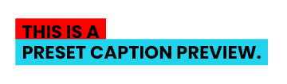<br><code>5o</code></a></td>
    <td align="center" valign="bottom" bgcolor="#111827"><a href="../assets/json/caption-style-presets/apple-music.json">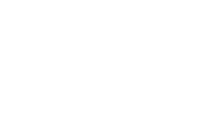<br><code>apple-music</code></a></td>
    <td align="center" valign="bottom" bgcolor="#111827"><a href="../assets/json/caption-style-presets/avatar-dialogue.json"><br><code>avatar-dialogue</code></a></td>
    <td align="center" valign="bottom" bgcolor="#111827"><a href="../assets/json/caption-style-presets/banger.json"><br><code>banger</code></a></td>
  </tr>
  <tr>
    <td align="center" valign="bottom" bgcolor="#111827"><a href="../assets/json/caption-style-presets/breaking-news.json"><br><code>breaking-news</code></a></td>
    <td align="center" valign="bottom" bgcolor="#111827"><a href="../assets/json/caption-style-presets/chic.json">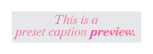<br><code>chic</code></a></td>
    <td align="center" valign="bottom" bgcolor="#111827"><a href="../assets/json/caption-style-presets/chrome-heartbreaker.json">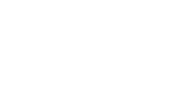<br><code>chrome-heartbreaker</code></a></td>
    <td align="center" valign="bottom" bgcolor="#111827"><a href="../assets/json/caption-style-presets/clean.json"><br><code>clean</code></a></td>
  </tr>
  <tr>
    <td align="center" valign="bottom" bgcolor="#111827"><a href="../assets/json/caption-style-presets/coco.json">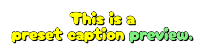<br><code>coco</code></a></td>
    <td align="center" valign="bottom" bgcolor="#111827"><a href="../assets/json/caption-style-presets/gamerboy.json"><br><code>gamerboy</code></a></td>
    <td align="center" valign="bottom" bgcolor="#111827"><a href="../assets/json/caption-style-presets/go-viral.json"><br><code>go-viral</code></a></td>
    <td align="center" valign="bottom" bgcolor="#111827"><a href="../assets/json/caption-style-presets/goa-24.json"><br><code>goa-24</code></a></td>
  </tr>
  <tr>
    <td align="center" valign="bottom" bgcolor="#111827"><a href="../assets/json/caption-style-presets/golden-ticket.json"><br><code>golden-ticket</code></a></td>
    <td align="center" valign="bottom" bgcolor="#111827"><a href="../assets/json/caption-style-presets/high-alert.json">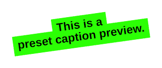<br><code>high-alert</code></a></td>
    <td align="center" valign="bottom" bgcolor="#111827"><a href="../assets/json/caption-style-presets/hip-hop.json">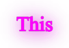<br><code>hip-hop</code></a></td>
    <td align="center" valign="bottom" bgcolor="#111827"><a href="../assets/json/caption-style-presets/ig-classic-sticker-2.json"><br><code>ig-classic-sticker-2</code></a></td>
  </tr>
  <tr>
    <td align="center" valign="bottom" bgcolor="#111827"><a href="../assets/json/caption-style-presets/ig-classic-sticker.json"><br><code>ig-classic-sticker</code></a></td>
    <td align="center" valign="bottom" bgcolor="#111827"><a href="../assets/json/caption-style-presets/ig-demure.json">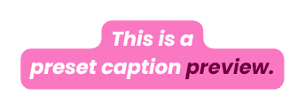<br><code>ig-demure</code></a></td>
    <td align="center" valign="bottom" bgcolor="#111827"><a href="../assets/json/caption-style-presets/ig-sticker.json">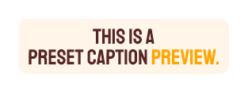<br><code>ig-sticker</code></a></td>
    <td align="center" valign="bottom" bgcolor="#111827"><a href="../assets/json/caption-style-presets/ig-typewriter.json">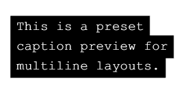<br><code>ig-typewriter</code></a></td>
  </tr>
  <tr>
    <td align="center" valign="bottom" bgcolor="#111827"><a href="../assets/json/caption-style-presets/imessage.json">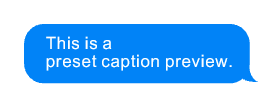<br><code>imessage</code></a></td>
    <td align="center" valign="bottom" bgcolor="#111827"><a href="../assets/json/caption-style-presets/impact.json"><br><code>impact</code></a></td>
    <td align="center" valign="bottom" bgcolor="#111827"><a href="../assets/json/caption-style-presets/karaoke-1.json">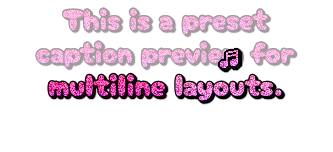<br><code>karaoke-1</code></a></td>
    <td align="center" valign="bottom" bgcolor="#111827"><a href="../assets/json/caption-style-presets/love-story.json">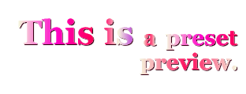<br><code>love-story</code></a></td>
  </tr>
  <tr>
    <td align="center" valign="bottom" bgcolor="#111827"><a href="../assets/json/caption-style-presets/main-character.json">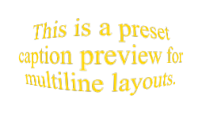<br><code>main-character</code></a></td>
    <td align="center" valign="bottom" bgcolor="#111827"><a href="../assets/json/caption-style-presets/no-context.json">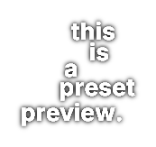<br><code>no-context</code></a></td>
    <td align="center" valign="bottom" bgcolor="#111827"><a href="../assets/json/caption-style-presets/poppy.json"><br><code>poppy</code></a></td>
    <td align="center" valign="bottom" bgcolor="#111827"><a href="../assets/json/caption-style-presets/presentation.json">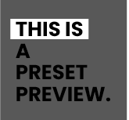<br><code>presentation</code></a></td>
  </tr>
  <tr>
    <td align="center" valign="bottom" bgcolor="#111827"><a href="../assets/json/caption-style-presets/punch.json"><br><code>punch</code></a></td>
    <td align="center" valign="bottom" bgcolor="#111827"><a href="../assets/json/caption-style-presets/slide-with-me.json">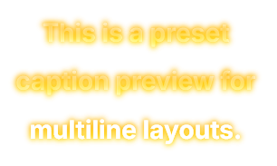<br><code>slide-with-me</code></a></td>
    <td align="center" valign="bottom" bgcolor="#111827"><a href="../assets/json/caption-style-presets/snapchat.json"><br><code>snapchat</code></a></td>
    <td align="center" valign="bottom" bgcolor="#111827"><a href="../assets/json/caption-style-presets/sour-gummy.json"><br><code>sour-gummy</code></a></td>
  </tr>
  <tr>
    <td align="center" valign="bottom" bgcolor="#111827"><a href="../assets/json/caption-style-presets/take-your-chance.json">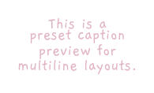<br><code>take-your-chance</code></a></td>
    <td align="center" valign="bottom" bgcolor="#111827"><a href="../assets/json/caption-style-presets/twitch-classic.json"><br><code>twitch-classic</code></a></td>
    <td align="center" valign="bottom" bgcolor="#111827"><a href="../assets/json/caption-style-presets/vintage.json"><br><code>vintage</code></a></td>
    <td align="center" valign="bottom" bgcolor="#111827"><a href="../assets/json/caption-style-presets/youtube-classic.json">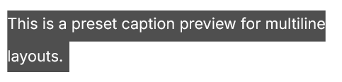<br><code>youtube-classic</code></a></td>
  </tr>
</table>
