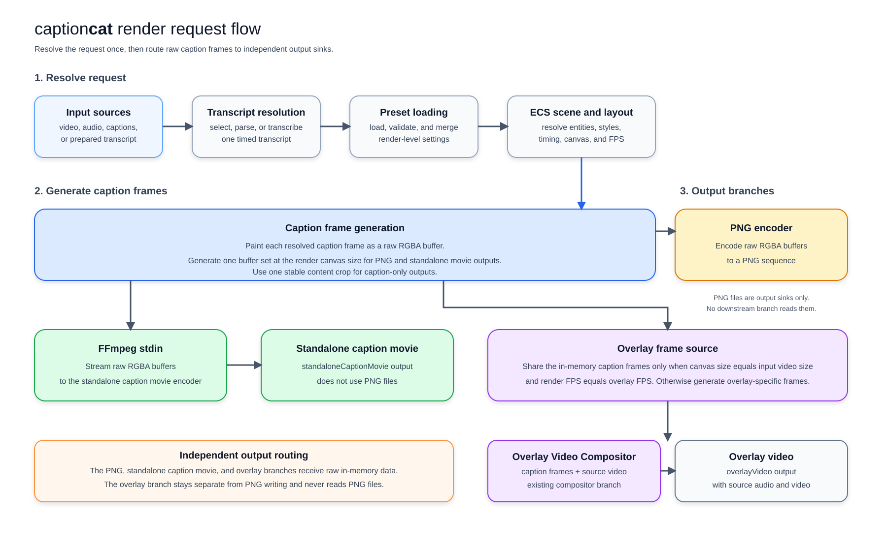
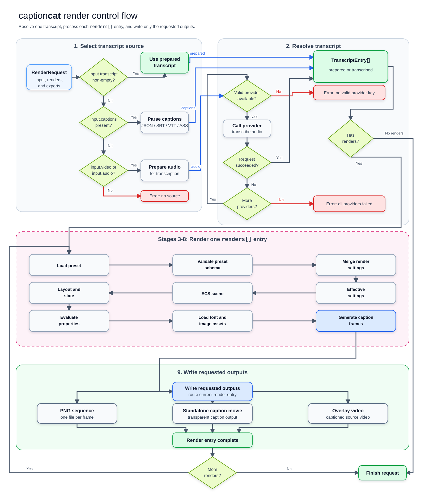

# Render pipeline

_Reference: [Entity Component System (ECS)](https://en.wikipedia.org/wiki/Entity_component_system)_

This page describes how **captioncat** resolves a render request. For request
examples and option reference, see [Rendering](rendering.md).

The engine resolves one transcript, loads one preset for each render entry, and
uses the resolved scene to create the requested visual outputs.

<small><em>**captioncat** frame and output flow: in-memory RGBA reuse and independent output branches.</em></small>

<small><em>**captioncat** render control flow: input selection, transcript fallback, and the per-render loop.</em></small>

## Request stages

The engine processes a request in two parts. First, it resolves one transcript.
Then, it renders that transcript with each entry in `renders`.

Stages 3 through 8 run once for each entry in `renders`. If `renders` is
omitted, the engine can still write request-level transcript or subtitle
exports, but it does not build a visual Entity Component System (ECS) scene.

### Stage 1: Input source selection

The engine reads the input sources from `request.input`. Each source has a
different role in transcript resolution and visual output.

| Input              | Accepted values                            | Use                                                                        |
| ------------------ | ------------------------------------------ | -------------------------------------------------------------------------- |
| `input.video`      | A local path, HTTP(S) URL, or `Uint8Array` | Source for overlay video, video dimensions, video FPS, and extracted audio |
| `input.audio`      | A local path, HTTP(S) URL, or `Uint8Array` | Audio source for transcription and overlay video composition               |
| `input.captions`   | A file path, HTTP(S) URL, or `Uint8Array`  | Caption or transcript file in `json`, `srt`, `vtt`, or `ass` format        |
| `input.transcript` | `TranscriptEntry[]`                        | Prepared transcript data that does not need a provider                     |

The engine resolves these sources in priority order:

1. A non-empty `input.transcript` is used first.
2. `input.captions` is parsed when no prepared transcript exists.
3. `input.video` supplies audio for transcription when no transcript or caption
   file exists.
4. `input.audio` supplies audio for transcription when no video exists.
5. The engine returns an error when none of these sources provides a transcript.

The engine does not call a transcription provider when it uses
`input.transcript` or `input.captions`. This prevents an unnecessary provider
request when timed text is already available.

An empty `input.transcript` array does not count as a transcript source. The
engine continues to the next source in the priority order.

If both `input.video` and `input.audio` are present, the video remains the
visual source and the separate audio input supplies the transcription audio.
If `input.video` is present without `input.audio`, the engine extracts audio
from the video before transcription.

### Stage 2: Transcript resolution

The engine converts the selected source into `TranscriptEntry[]` data. Prepared
transcripts pass through without a provider request.

Caption files support JSON transcript data, SRT, WebVTT, and ASS. A string
source can be a local file path or an HTTP(S) URL. The parser returns timed
transcript entries from the selected file.

An unsupported or invalid file produces a parsing error.

When the selected transcript entry contains `words`, the engine uses each word
and its timing. When an entry has no word list, the engine splits its text into
whitespace-separated tokens and divides the entry duration between those
tokens.

When the input contains only `input.video` or `input.audio`, the engine creates
a temporary audio file when required. It sends that file to the configured
provider list.

#### Transcription provider selection

The engine normalizes the configured provider names and keeps their array
order. It uses the first provider with a valid credential.

The engine reads `apiKey` from the provider entry first. If that value is
missing, it reads the matching environment variable, such as `OPENAI_API_KEY`.

The engine skips a provider when its name is unsupported or its credential is
missing. It sends the transcription request to the next provider.

If a provider request fails, the engine records the error and tries the next
provider. A successful response, including an empty result, ends the fallback
process.

The engine reports an error when every provider fails. It also reports an error
when no configured provider has a valid credential.

### Stage 3: Preset loading and schema validation

The engine loads the `preset` for each entry in `renders`. The source can be a
bundled preset name, an inline ECS object, a local JSON file, or an HTTP(S) URL.

The engine loads each preset source once for its render entry. It reuses the
loaded preset for every visual output in that entry.

The loader parses JSON file and URL sources. It rejects invalid JSON and
presets that do not match the supported ECS schema version.

Schema normalization prepares values such as the state window for the ECS
pipeline. This step does not change the source preset object.

### Stage 4: ECS scene construction

The engine uses the preset `design` as the root of the ECS scene. The scene
contains the entities, components, and effects that define the caption style.

The engine creates the runtime scene from the preset for the selected transcript
and render entry. Each visual output uses the same resolved scene.

### Stage 5: Caption layout and state resolution

The engine merges `renders[].settings.captionLayout` over the preset
`captionLayout`. An omitted override leaves the preset layout unchanged. The
engine resolves `renders[].settings.timing` over the preset `timing`.

The engine applies the render language hint to text segmentation and direction
resolution. If the render has no language, the first configured provider
language can supply the hint.

The state window selects the active caption state for each point in the
transcript. Caption layout then resolves flow, alignment, wrapping, spacing,
and placement for the active scene.

The layout canvas comes from `renders[].canvasSize`. When it is omitted and
`input.video` is present, the engine uses the input video's width and height.
Audio-only requests must specify one `canvasSize` for each render entry that
requests a caption-only output.
An overlay video uses the input video's width and height.

### Stage 6: Property, animation, transition, and follow evaluation

The ECS pipeline resolves component properties for each caption frame. It
applies static values, animated values, transitions, and follow relationships.

The resolved values include entity position, size, opacity, color, text style,
effect parameters, and visibility. The pipeline evaluates these values against
the current caption time and frame rate.

This stage also applies direction-aware layout and the timing behavior from the
preset state window. The result is a complete scene description for one frame.

### Stage 7: Font and image loading

The engine loads fonts and images before it measures or paints the scene. This
keeps text bounds consistent between layout and frame generation.

Font lookup uses bundled sources first, then Google Fonts, direct remote
sources, and system or generic CSS fallbacks. Remote sources need network
access.

The engine loads image assets required by image components and effects. A
missing asset stops the render with an asset-loading error.

### Stage 8: Caption frame generation

The engine measures the resolved scene and paints caption frames to canvas
buffers. It applies the selected FPS and the resolved render canvas size.

PNG sequences and standalone caption movies use `30` FPS when `renders[].fps` is omitted.
Overlay videos use the source video FPS, or `30` when the source FPS is
unavailable.

The engine keeps caption frame buffers in memory for the visual outputs in the
render entry. PNG and standalone caption movie outputs use the same layout
canvas and share one generation.

The pipeline always writes PNG and standalone caption movie frames at one
stable tight crop around visible caption content. The crop remains fixed
across the complete render.

The standalone caption movie writer streams raw RGBA buffers to FFmpeg stdin.
It does not create an intermediate PNG sequence for the movie.

When `canvasSize` matches the input video's dimensions and the render FPS matches
the overlay FPS, the overlay uses the same in-memory caption frame generation.
The overlay compositor remains unchanged. If the dimensions or FPS do not match,
the overlay renders its own frames because caption layout and frame timing can
differ.

The engine also creates debug guides when a request-level debug flag is `true`.

### Stage 9: Request-level exports and visual outputs

The engine writes request-level transcript and subtitle exports from the
resolved transcript. It writes only the formats that have an output path.

The engine then writes the visual outputs for each render entry:

- `pngSequence` writes one PNG file for each caption frame.
- `standaloneCaptionMovie` writes a transparent standalone caption movie at the
  stable tight crop size.
- `overlayVideo` composites caption frames over `input.video`.

An overlay video uses the selected compositor. `ffmpeg-compositor` is the
default. `skia-compositor` runs in Node.js when its runtime conditions are met.
The engine falls back to FFmpeg when those conditions are not met.

If one render entry requests several visual outputs, the engine uses the same
resolved transcript and loaded preset for all of them. PNG and standalone
caption movie outputs share one in-memory frame generation. When `canvasSize`
and FPS match the input video, the overlay output also uses that generation.

## Frame boundaries

`generateSubtitleImagesEcs` renders the complete sequence by default. A caller
can set `stopAfterFrameIndex` to a zero-based frame index.

The pipeline emits that frame and then stops. This option supports callers that
need one frame or a short prefix, such as promo image generation.

The option does not change video or PNG-sequence rendering when it is omitted.
When the option is set, returned timing metadata can be incomplete because the
pipeline stops before later events.
